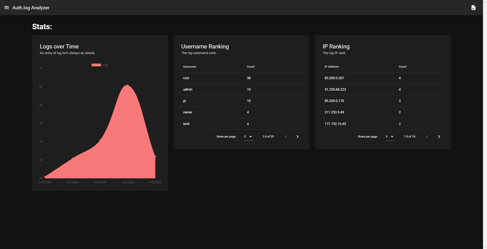

# auth-log-analyzer

Analyzes `Auth.log` files for you!

## Prerequisites
These are the folloing dependencies:
- NodeJS ^12.16.2
- npm ^6.14.4
- vue ^2.5.17
- vue-router ^3.1.6
- vuetify ^2.2.11

The following are devDependencies and are optional:
- @vue/cli ^4.3.1

## Contents
This is a Vue.js web app hosted on Google Firebase that reads auth.log files from the user to extract and display various data from it. 

This project has been created using `vue-cli`, `webpack-simple`, `firebase-tools`

## Demo
The following diagram explains how the system works:
  
  
The following is the output of the dummy data that has been provided:
  

I've hosted an example web app on Firebase that can be used to demo the sample demo log file I've uploaded.

This repository contains a sample log file, `/rsc/auth-test.txt`, that can be used for testing.  
1. Simply navigate to the sample [demo page]("https://auth-log-analyzer.web.app/").
2. Click the load button on the navigation bar.
3. Select the `auth-test.txt` that you downloaded and wait until the analysis is complete.


## Project setup
Install necessary dependencies using npm.
```
npm install
```

### Compiles and hot-reloads for development
```
npm run serve
```

### Compiles and minifies for production
```
npm run build
```

### Run your tests
```
npm run test
```

### Lints and fixes files
```
npm run lint
```

### Deploy to Firebase
You need to compile the app for a production environment first and only after can you then deploy it to Firebase.  
This web app only needs Firebase to host.
```
npm run build
firebase deploy --only hosting
```

## Host Vue.js apps in Firebase
To learn how to host Vue.js apps in Firebase, click [here](https://cli.vuejs.org/guide/deployment.html#firebase)!
